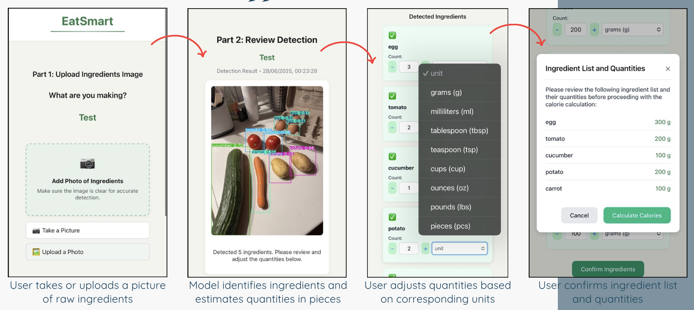
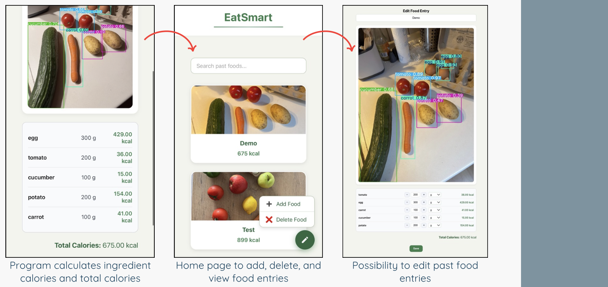

# EatSmart: Food Calorie Counter Web App

A web-based application that uses computer vision to detect pre-cooked food ingredients from images and estimate their calorie content. Users can upload images of food ingredients, review detected items, adjust quantities and units, and calculate total calories.

## Table of Content
- [Motivation](#motivation)
- [Demonstration](#demonstration)
- [Tech Stack](#tech-stack)
- [Limitation](#limitation)
- [Areas for Improvement](#areas-for-improvement)
- [Authors](#authors)

## Motivation
Tracking calorie intake manually is often time-consuming and inaccurate, as it requires users to search for ingredients and estimate portions themselves. This project aims to simplify the process by using computer vision to automatically detect food ingredients from images and calculate their calories. To improve accuracy, the system uses a well-known food database (Edamam API) for reliable nutritional information. The goal is to make calorie tracking faster, more efficient, and more user-friendly. This project is part of an academic computer vision course and aims to demonstrate how computer vision can be applied to a practical real-world problem in health and lifestyle management.

## Demonstration
### How does the web application work?

  

  

## Tech Stack

### Frontend
- **React**
  - JavaScript library for building user interfaces with reusable components
  - Used to build interactive pages: Upload, Review Detection, Calculate

### Backend
- **FastAPI**
  - High-performance web framework for Python APIs
  - Used to handle client requests, logic for calorie calculation, and communicate with the database
  - Integrated Edamam API and YOLOv8 prediction responses

### Database & API
- **PostgreSQL**
  - Open-source relational database for storing food entries and ingredient data 
- **Edamam API**
  - External service used to retrieve calorie values based on ingredient, quantity, and unit

### Computer Vision Model
- **YOLOv8**
  - Real-time object detection model used to identify ingredients from uploaded images  
- **CVAT**
  - Annotation tool used to label ingredients and train/refine the YOLOv8 model

## Limitation
This project is developed as part of an academic course and is intended for demonstration and learning purposes only. It is not deployed and currently runs only in a local development environment, therefore it is not suitable for real-world or production use.
The calorie calculation feature was originally implemented using the Edamam Food Database API. However, due to subscription limitations, the API is no longer active in this project. As a result, calorie computation may be limited or unavailable unless valid API credentials are provided.

In addition, the application requires a locally configured PostgreSQL database. Since database credentials are managed through environment variables and are not included in the repository for security reasons, users must manually set up and configure the database before running the project.

Furthermore, the accuracy of ingredient detection depends on the trained model and image quality, and may not always be reliable. The system also supports only a limited set of ingredients and units, which can further affect the overall accuracy and usability.

## Areas for Improvement
There are several areas where this project can be further enhanced:
- Deploy the application to a cloud platform for public access
- Improve the accuracy and robustness of the computer vision model
- Expand the dataset to support more diverse food ingredients
- Enhance unit handling and validation for better consistency
- Add a more detailed nutritional breakdown (e.g., protein, fat, carbohydrates)
- Implement real-time detection using a camera instead of static image upload
- Improve UI/UX for a more intuitive user experience
- Add user accounts and history tracking

## Authors
1. Vivian Theodora Yang
2. Isabella Augustine Yang
3. Jabrayil Mirzayev
4. Enis Jaha
